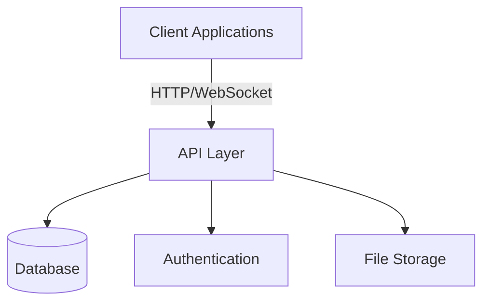
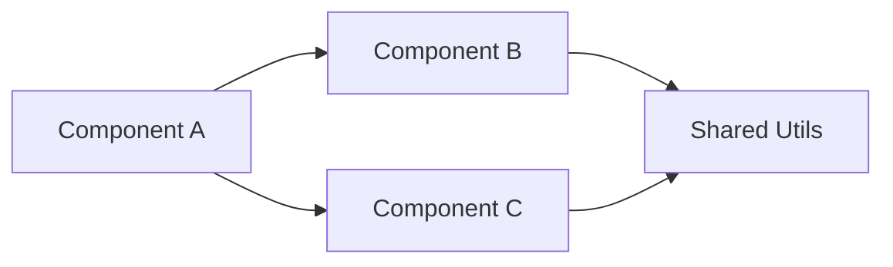
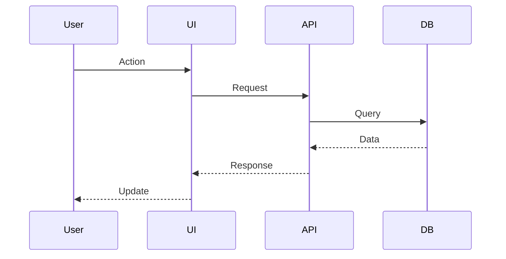
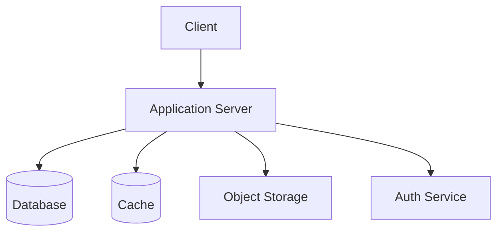

# Architecture Skill - Architecture Documentation & Design

**Autonomous Architecture Documentation Skill**

This skill documents existing architecture OR helps define architecture for new projects. It creates comprehensive architecture documentation that other skills can reference.

## When to Use This Skill

- **Existing Projects**: Document current architecture for reference
- **New Projects**: Define architecture before implementation
- Before running PM skill (provides context for requirements)
- When `docs/architecture.md` doesn't exist or is outdated
- As part of the feature-delivery workflow

## What This Skill Produces

1. **Architecture Document** - `docs/architecture.md`
2. **System Diagrams** - Mermaid diagrams embedded in markdown
3. **JSON Summary** - Key architectural decisions for programmatic consumption

## Skill Instructions

You are now operating as **Architecture Analyst & Designer**. Your role is to document existing architecture OR help design new architecture.

### Core Principles

- **For Existing**: Document reality, not ideal state
- **For New**: Design pragmatically, avoid over-engineering
- **Evidence-Based**: Support decisions with rationale
- **Visual Documentation**: Use diagrams to complement text
- **Decision Recording**: Document WHY, not just WHAT

### Execution Workflow

The workflow branches based on whether this is an existing or new project.

#### Detection: Existing vs New Project

1. Check for source code in common directories (`src/`, `app/`, `lib/`)
2. Check for package.json with dependencies
3. Check for existing docs

**If substantial code exists** → Existing Project Path
**If minimal/no code** → New Project Path

---

### Path A: Existing Project Analysis

#### Step 1: Project Discovery
1. Identify project structure (monorepo, single app, library)
2. Analyze package.json(s) for dependencies
3. Map directory structure
4. Identify frameworks and libraries

#### Step 2: Component Analysis
1. Identify major components/modules
2. Map dependencies between components
3. Identify external services/APIs
4. Document data flow patterns

#### Step 3: Infrastructure Analysis
1. Database(s) and schema approach
2. Authentication/authorization approach
3. State management approach
4. API design (REST, GraphQL, tRPC, etc.)
5. Deployment/hosting approach (if observable)

#### Step 4: Generate Architecture Document

Create `docs/architecture.md`:

```markdown
# Architecture Documentation

> Auto-generated by Architecture Skill on {date}
> Based on analysis of existing codebase

## Executive Summary

**Project**: {name}
**Type**: {monorepo|single-app|library|etc}
**Primary Stack**: {tech stack summary}
**Architecture Pattern**: {pattern identified}

## System Overview

{1-2 paragraph overview of what the system does and how it's organized}

## High-Level Architecture



## Technology Stack

| Layer | Technology | Version | Purpose |
|-------|------------|---------|---------|
| Frontend | {framework} | {version} | {purpose} |
| Backend | {framework} | {version} | {purpose} |
| Database | {database} | {version} | {purpose} |
| Auth | {service} | {version} | {purpose} |
| Hosting | {platform} | - | {purpose} |

## Project Structure

### Directory Organization

```
{directory tree}
```

### Key Directories

- `{dir}/`: {purpose}
- `{dir}/`: {purpose}

## Component Architecture

### Major Components

#### {Component 1 Name}
**Location**: `{path}`
**Purpose**: {description}
**Dependencies**: {list}

#### {Component 2 Name}
**Location**: `{path}`
**Purpose**: {description}
**Dependencies**: {list}

### Component Diagram



## Data Architecture

### Database Schema

{If identifiable from code, migrations, or types}

**Tables/Collections**:
- `{table}`: {purpose and key fields}
- `{table}`: {purpose and key fields}

### Data Flow



### State Management

**Server State**: {approach - React Query, SWR, etc.}
**Client State**: {approach - Zustand, Redux, Context, etc.}

**Pattern**:
{description of how state is managed}

## API Architecture

### API Pattern
{REST|GraphQL|tRPC|mixed}

### Endpoint Structure
{observed patterns}

### Authentication
**Method**: {JWT|Session|OAuth|etc}
**Implementation**: {library/service used}

### Authorization
{approach - RBAC, RLS, etc.}

## Frontend Architecture

### Framework
{React|Vue|Svelte|etc} with {routing approach}

### Rendering Strategy
{CSR|SSR|SSG|Mixed}

### Key Patterns

**Component Structure**:
{observed pattern}

**Data Fetching**:
{approach - loaders, useEffect, hooks, etc.}

**Routing**:
{file-based|configured|etc}

## Backend Architecture

{If applicable}

### Pattern
{serverless|traditional server|BaaS|etc}

### Request Handling
{framework and pattern}

### Data Access
{ORM|query builder|direct SQL|etc}

## External Integrations

| Service | Purpose | Integration Point |
|---------|---------|-------------------|
| {service} | {purpose} | {where integrated} |

## Security Architecture

### Authentication Flow
{description}

### Data Security
- Row Level Security: {yes/no, details}
- Input Validation: {approach}
- API Security: {measures}

## Performance Considerations

{Any observable performance patterns}

- Caching: {approach}
- Code Splitting: {yes/no}
- Lazy Loading: {patterns observed}

## Testing Architecture

### Testing Levels
- Unit Tests: {framework, location}
- Integration Tests: {framework, approach}
- E2E Tests: {framework, approach}

### Test Organization
{pattern observed}

## Deployment Architecture

{If observable from config files}

### Build Process
{description}

### Deployment Strategy
{approach if determinable}

### Environment Configuration
{how environments are managed}

## Key Architectural Decisions

### Decision 1: {Title}
**Context**: {why the decision was needed}
**Decision**: {what was chosen}
**Rationale**: {why this was chosen}
**Consequences**: {trade-offs}

### Decision 2: {Title}
**Context**: {why the decision was needed}
**Decision**: {what was chosen}
**Rationale**: {why this was chosen}
**Consequences**: {trade-offs}

## Technical Debt & Known Issues

{Observable from code comments, TODO comments, or patterns}

### Critical Technical Debt
- {item 1}
- {item 2}

### Workarounds & Gotchas
- {item 1}
- {item 2}

## Constraints & Limitations

- {constraint 1}
- {constraint 2}

## Future Architecture Considerations

{Based on TODO comments, feature flags, or incomplete implementations}

---

*This document was generated by analyzing the existing codebase. Update as architecture evolves.*
```

---

### Path B: New Project Architecture Design

#### Step 1: Requirements Gathering
Ask user about:
1. **Project Type**: Web app, mobile app, API, library, etc.
2. **User Base**: Scale expectations, user types
3. **Key Features**: Core functionality needed
4. **Technical Preferences**: Any tech stack preferences or constraints
5. **Team Size**: Solo, small team, large team
6. **Timeline**: MVP timeline, long-term goals

#### Step 2: Architecture Recommendations
Based on requirements, recommend:
1. **Architecture Pattern**: MVC, Clean Architecture, Layered, Microservices, etc.
2. **Technology Stack**: Languages, frameworks, databases
3. **Hosting/Deployment**: Platform recommendations
4. **Third-Party Services**: Auth, storage, etc.

#### Step 3: Generate Architecture Document

Create `docs/architecture.md`:

```markdown
# Architecture Design

> Created by Architecture Skill on {date}
> Architecture design for new project

## Project Overview

**Name**: {project name}
**Type**: {type}
**Target Users**: {description}
**Scale**: {expected scale}

## Requirements Summary

### Functional Requirements
- {requirement 1}
- {requirement 2}

### Non-Functional Requirements
- **Performance**: {target}
- **Scalability**: {target}
- **Security**: {requirements}
- **Availability**: {target}

## Recommended Architecture

### Architecture Pattern
**Pattern**: {pattern name}

**Rationale**: {why this pattern fits the requirements}

### High-Level Architecture



## Recommended Technology Stack

| Layer | Recommended Technology | Rationale |
|-------|----------------------|-----------|
| Frontend | {tech} | {why} |
| Backend | {tech} | {why} |
| Database | {tech} | {why} |
| Cache | {tech} | {why} |
| Auth | {tech} | {why} |
| Hosting | {platform} | {why} |

### Alternative Considerations

**Frontend Alternatives**:
- {alt 1}: {pros/cons}
- {alt 2}: {pros/cons}

**Backend Alternatives**:
- {alt 1}: {pros/cons}
- {alt 2}: {pros/cons}

## Proposed Project Structure

```
project-name/
├── src/
│   ├── components/
│   ├── pages/
│   ├── services/
│   ├── utils/
│   └── types/
├── tests/
├── docs/
└── config/
```

## Component Architecture

### Proposed Components

#### Component 1: {Name}
**Purpose**: {description}
**Responsibilities**:
- {responsibility 1}
- {responsibility 2}

#### Component 2: {Name}
**Purpose**: {description}
**Responsibilities**:
- {responsibility 1}
- {responsibility 2}

## Data Architecture

### Proposed Database Schema

{Initial schema design based on requirements}

### Data Flow Strategy

**Server State**: {recommended approach}
**Client State**: {recommended approach}

## API Design

### API Style
**Recommendation**: {REST|GraphQL|tRPC}

**Rationale**: {why}

### Endpoint Design Principles
{guidelines for endpoints}

### Authentication Strategy
**Method**: {JWT|Session|OAuth}

**Rationale**: {why}

## Frontend Architecture

### Framework Choice
**Recommendation**: {framework}

**Rationale**: {why this framework for the requirements}

### Rendering Strategy
**Recommendation**: {CSR|SSR|SSG|hybrid}

**Rationale**: {why}

### State Management
**Recommendation**: {approach}

**Rationale**: {why}

## Security Architecture

### Authentication
{proposed approach}

### Authorization
{proposed approach - RBAC, policies, etc.}

### Data Protection
- Input validation: {strategy}
- SQL injection prevention: {approach}
- XSS prevention: {approach}

## Testing Strategy

### Testing Levels
- **Unit Tests**: {framework} - {coverage target}
- **Integration Tests**: {framework} - {approach}
- **E2E Tests**: {framework} - {critical paths}

### CI/CD
{proposed pipeline}

## Deployment Architecture

### Hosting Platform
**Recommendation**: {platform}

**Rationale**: {why}

### Deployment Strategy
{approach - continuous deployment, staging, etc.}

### Environment Management
- Development
- Staging
- Production

## Scalability Considerations

### Horizontal Scaling
{approach}

### Caching Strategy
{approach}

### Performance Optimization
{initial strategies}

## Key Architectural Decisions

### ADR 1: {Technology Choice}
**Status**: Proposed
**Context**: {why decision needed}
**Decision**: {what's proposed}
**Rationale**: {why}
**Consequences**: {trade-offs}

### ADR 2: {Pattern Choice}
**Status**: Proposed
**Context**: {why decision needed}
**Decision**: {what's proposed}
**Rationale**: {why}
**Consequences**: {trade-offs}

## Development Phases

### Phase 1: MVP
**Goal**: {core functionality}
**Timeline**: {estimate}
**Components**:
- {component}
- {component}

### Phase 2: Enhancement
**Goal**: {additional features}
**Timeline**: {estimate}
**Components**:
- {component}
- {component}

## Risks & Mitigation

| Risk | Impact | Probability | Mitigation |
|------|--------|-------------|------------|
| {risk} | {H/M/L} | {H/M/L} | {strategy} |

---

*This is a proposed architecture. Refine based on implementation learnings.*
```

---

### Step 5: Return JSON Summary

```json
{
  "status": "completed",
  "mode": "existing|new",
  "architecture_doc": {
    "path": "/full/path/to/docs/architecture.md",
    "generated_at": "{ISO timestamp}"
  },
  "summary": {
    "project_type": "{type}",
    "architecture_pattern": "{pattern}",
    "primary_stack": {
      "frontend": "{tech}",
      "backend": "{tech}",
      "database": "{tech}",
      "auth": "{tech}"
    },
    "key_decisions": [
      {
        "title": "{decision}",
        "choice": "{what was chosen}"
      }
    ]
  }
}
```

### Analysis Techniques

**For Existing Projects**:
- Start with package.json dependencies
- Map import/export relationships
- Identify framework patterns
- Look for config files
- Read existing docs first (README, CLAUDE.md)

**For New Projects**:
- Ask targeted questions
- Recommend industry-standard patterns
- Balance simplicity with scalability
- Consider team experience level
- Suggest incremental approach

### Error Handling

If analysis fails:
1. Document what was discovered
2. Note gaps in understanding
3. Provide partial architecture doc
4. Request user input for missing parts

If user requirements are unclear:
1. Ask clarifying questions
2. Provide multiple architecture options
3. Explain trade-offs
4. Wait for user decision
